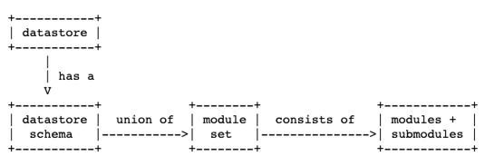

<!--- npx @marp-team/marp-cli@latest yangPrimer.md -o yangPrimer.pdf --pdf --allow-local-files ; npx @marp-team/marp-cli@latest yangPrimer.md -o yangPrimer.html --html --allow-local-files -->
<!-- backgroundImage: "linear-gradient(to bottom, #13aaed, #0801)" -->

# YANG Primer

---

<!-- backgroundImage: "" -->
<!-- footer: "YANG Primer" -->

## NETCONF/RESTCONF with YANG


---

## What is Data Model?


- A data-model determines the structure, syntax and semantics of the data…
  - that is externally visible
  - Consistent and complete
- Protocol
  - Remote primitives to view and manipulate the data
    -Encoding of the data as defined by the data-model

---

## What is YANG (1)

- **YANG** is a **data modeling language** used to model configuration and state data manipulated by the **Network Configuration Protocol** (NETCONF), NETCONF remote procedure calls, and NETCONF notifications.
- **YANG 1.0** is defined in **RFC6020**.
  - Describe syntax and semantics of the YANG language
  - Also describe how a data model defined in a YANG module is encoded in the Extensible Markup Language (XML) and how NETCONF operations are used to manipulate the data
- **YANG 1.1** is defined in **RFC7950**
  - Describe syntax and semantics of version 1.1 of the YANG language
  - It is a maintenance release of the YANG language, addressing defects in the original specification - it does not obsolete RFC6020

---

## What is YANG (2)

- YANG modules can be translated into an equivalent XML syntax called YANG Independent Notation (YIN), allowing applications using XML parsers and Extensible Stylesheet Language Transformations (XSLT) scripts to operate on the models.
- YANG maintains compatibility with the Simple Network Management Protocol's (SNMP's) SMIv2. SMIv2-based MIB modules can be automatically translated into YANG modules for read-only access
- The YANG language was developed by the IETF NETCONF Data Modelling Language Working Group [NETMOD](http://www.ietf.org/html.charters/netmod-charter.html)

---

## Relationship between NETCONF and YANG

- The **NETCONF protocol** is a formal application programming interface (API) that allows configuration data information to be retrieved and manipulated
- The **YANG data modeling language** is used to model configuration and state data manipulated by NETCONF
- NETCONF is **not replacing** CORBA/SOAP/REST; it provides full set of semantics for configuration management
- YANG is **not replacing** XSD/RelaxNG/WSDL; it provides many features specific to configuration management

---

## SNMP vs. NETCONF

|                         | SNMP             | NETCONF           |
| ----------------------- | ---------------- | ----------------- |
| Standard                | IETF             | IETF              |
| Resources               | OIDs             | Paths             |
| Data Models             | Defined  in MIBs | YANG  Core Models |
| Data Modelling Language | SMI              | YANG              |
| Management Operations   | SNMP             | NETCONF           |
| Encoding                | BER              | XML               |
| Transport  Stack        | UDP              | SSH, TCP          |

---

## NETCONF and YANG in Context


---

## YANG Module Contents


---

## YANG Module Layout

```yang
module <module-name> {
  // header information
    <yang-version statement>
    <namespace statement>
    <prefix statement>
  // linkage statements
    <import statements>
    <include statements>
  // meta information
    <organization statement>
    <contact statement>
    <description statement>
    <reference statement>
  // revision history
    <revision statements>
  // module definitions
    <other statements>
}
```

---

## YANG Module


---

## YANG Module - HEADER

- `module`
  - describe the module and give information about the module itself
- `namespace` statement
  - YANG defines its own namespace for NETCONF <edit-config> operations. This namespace is "urn:ietf:params:xml:ns:yang:"
- `prefix` statement
  - It is used to define the prefix associated with the module and its namespace.  The "prefix" statement's argument is the prefix string that is used as a prefix to access a module.

---

## YANG Module - Meta Information and Revision History

- `organization` statements
  - defines the party responsible for this module.
- `contact` statements
  - provides contact information for the module.
- Definition statements
  - takes as an argument a string that contains a human-readable textual description of this definition.
- `revision` statements
  - specifies the editorial revision history of the module, including the initial revision.

---

## Defining a Container

- `container` statement:
  - Defines an interior data node in the schema tree
  - No value, but has a list of child nodes in the data tree

```yang
container interfaces {
  description "Interface configuration parameters.";
  ...
}
```

---

## Defining a List

- `list` statement:
  - Defines an interior data node in the schema tree.
  - Represents a collection of entries - each entry consists of one or more nodes

```yang
container interfaces{
list interfaces {
  key "name";
  description "The list of configured interfaces on the device.";
  ...
}
list interfaces-state{
  config false;
  key "name";
  description "Data nodes for the operational state of interfaces."
  ...
}
```

---

## Defining a List (read only / read write)

```yang
container interfaces{
  ...
list interfaces-state{
  config false;
  ...
}
```

- `config false;` – data under interfaces-state is read-only, typically operational nodes such as sensors
- `config true;` - the default, data is configuration and available to be modified  
- configuration and state are clearly separated within this data model

---

## Defining Leafs

- A `leaf` is defined by an identifier and has an associated type

```yang
list interface{
  key "name";
  description "...";
  leaf name {
    type string;
    description "The name of the interface"
  }
}
```

- Leaf name serves as list key
- Leaf `name` shown above is of type`string`

---

## Typical Leaf attributes

| Attribute | Purpose                                                      |
| --------- | ------------------------------------------------------------ |
| config    | Whether this leaf is a  configurable value (“true”) or operational value (“false”). Inherited from  parent container if not specified |
| default   | Specifies default value for this  leaf. Implies that leaf is optional |
| mandatory | Whether the leaf is mandatory  (“true”) or optional (“false”) |
| must      | XPath constraint that will be  enforced for this leaf        |
| type      | The data type (and range etc) of  this leaf                  |
---

## Typical Leaf attributes

| Attribute   | Purpose                                                      |
| ----------- | ------------------------------------------------------------ |
| when        | Conditional leaf, only present if  XPath expression is true  |
| description | Human readable definition and  help text for this leaf       |
| reference   | Human readable reference to some  other element or spec      |
| units       | Human readable unit specification  (e.g. Hz, MB/s, ℉)        |
| status      | Whether this leaf is “current”,  “deprecated” or “obsolete”  |

---

## Leaf - Built-In Types

| Type                              | Usage                                             |
| --------------------------------- | ------------------------------------------------- |
| binary                            | Any  binary data                                  |
| bits                              | A  set of bits or flags                           |
| boolean                           | "true"  or "false"                                |
| decimal64                         | 64-bit  signed decimal number                     |
| empty                             | A  leaf that does not have any value              |
| enumeration                       | One  of an enumerated set of strings              |

---

## Leaf - Built-In Types

| Type                              | Usage                                             |
| --------------------------------- | ------------------------------------------------- |
| identityref                       | A  reference to an abstract identity              |
| instance-identifier               | A  reference to a data tree node                  |
| Int8  / int16 / int32 / int64     | 8-bit  / 16-bit / 32-bit /64-bit signed integer   |
| leafref                           | A  reference to a leaf instance                   |
| string                            | A  character string                               |
| uint8  / uint16 / uint32 / uint64 | 8-bit  / 16-bit / 32-bit /64-bit unsigned integer |
| union                             | Choice  of member types                           |

---

## Leaf Type - `boolean`

- Leaf enabled with `boolean` value `true` or `false`
- This is where the interface can be enabled and disabled

```yang
list interface{
  key "name";
  description "...";
  leaf name {...}
  leaf enabled {
    type boolean;
    default "true";
    description
     "This leaf contains the configured, desired state of the interface."
  }
}
```

---

## Leaf Type - `union`

- Leaf can be one of many types
- Types are evaulated in the order listed

```yang
leaf name {
    type union {
      type vlan-id-type;
      type uint16;
      type binary {
        length 7;
      }
      type string;
    }
  }
```

- Generic types must be lower than specific types hence `string` could hold all others, therefore it is the lowest in this model

---

## Leaf Type - `boolean`

```yang
list interface{
  key "name";
  description "...";
  leaf name {...}
  leaf enabled {
    type boolean;
    default "true";
    description
     "This leaf contains the configured, desired state of the interface."
  }
}
```

---

## Leaf Type - `enumeration`

- Leaf `link-up-down-trap-enable` may take value enabled or disabled

```yang
list interface{
  key "name";
  leaf name {...}
  leaf enabled {...}
  leaf link-up-down-trap-enable {
    if-feature if-mib;
    type enumeration {
      enum enabled {value 1;}
      enum disabled {value 2;}
    }
  description "Controls whether linkUp/Down SNMP notifications should be generated";
  }
}
```

---

## Defining new Types

- New types can be defined using the `typedef` statement

#### declaration

```yang
typedef percent {
  type uint8 {
    range "0 .. 100";
  }
  description "Percentage";
}
```

#### example

```yang
leaf completed { type percent; }
```

---

## Define new Types - Examples

- RFC 6991: Common YANG Data Types
  - `ietf-inet-types` (ipv4- and ipv6-addresses, domain-name, etc)
  - `ietf-yang-types` (counters, gauges, date-and-time, etc)
  - `csdm-types`

---

### Define new Types - Example Derived

```yang
typedef date-and-time {
  type string {
    pattern '\d{4}\d{2}\d{2}T\d{2}:\d{2}:\d{2}
             (\.\d+)?'+ '(Z|[\+\-]\d{2}:\d{2})';
    }
  ]
}
```

- Example value: `2015-05-19T16:39:57-08:00`

---

### Combining types

```yang
  typedef nf-identifier {
    description
      "Primary identifier such as serial number, default MAC address or other unique definable attribute";
    type union {
      type ct:mac-address;
      type string {
        length "8..64";
      }
    }
  }
```  

---

## Conditional Leafs

- The `feature` statement is used to make segments of the model as conditional, i.e. only instantiated when conditions match

```yang
feature if-mib {
  description "This feature indicates that the device implements the IF-MIB.";
  reference "RFC 2863: The Interfaces Group MIB";
}
```

---

## Conditional Leafs

- The `if-feature` statement makes the parent statement conditional
- `link-up-down-trap-enable` leaf is a part of our model only if the `if-mib` feature is supported in the server

```yang
  list interface{
    ...
    leaf link-up-down-trap-enable {
      if-feature if-mib;
      type enumeration {
        enum enabled { value 1; }
        enum disabled { value 2; }
      }
    description "Controls whether linkUp/Down SNMP notifications should be generated";
  }
}
```

---

## Conditional Leafs

- The `choice` statement makes leafs entire existance conditional, acts as either/or and only one will apply
- The `case` name value must be unique throughout the associated module
- The `case` itself does not appear in the final generated YANG

```yang
  choice protocol-transport {
	case cli-ssh {
	  ...
	}
	case netconf {
	  ...
	}
  }
```

---

## Deviations

- Used against Standards YANG to indicate what is implmented on the running server
- Can annotate/refine Standards YANG to match available implementation

```yang
module example-deviations {
   yang-version 1.1;
   namespace "urn:example:deviations";
   prefix md;

   import example-base { prefix base; }
   deviation /base:system/base:daytime { deviate not-supported; }
   ...
 }
  
  deviation /base:system/base:user/base:type { deviate add { default "admin"; } }
  deviation /base:system/base:name-server { deviate replace { max-elements 3; } }
  deviation /base:system { deviate delete { must "daytime or time"; } }
```

---

## Imports and Includes


---

## Imports and Includes

#### import

- The `import` statement makes definitions from one module available inside another module or submodule

#### include

- The `include` statement is used to make content from a submodule available to that submodule’s parent module, or to another submodule of that parent module.
- submodule contains `belongs-to` to indicate related module

---

## Imports and Includes

#### Example `import`

```yang
import ietf-yang-types {
  prefix yang; 
}
...
leaf last-change {
  type yang:date-and-time;
  description "The time the interface entered its current operational state. If the current state was 
               entered prior to the last re-initialization of the local network management subsystem, 
               then this node is not present.";
  reference "RFC 2863: The Interfaces Group MIB - ifLastChange";
}
```

---

## Imports and Includes

#### Example `include`

```yang
module parent {
  namespace "urn:example:parent";
  prefix "p";
  include "child";
  uses one;
}
```

```yang
submodule child {
  belongs-to parent { prefix "p"; }
  import ietf-inet-types { prefix "inet"; }
  grouping one { ... }
}
```

---

## Reusable Node Groups

- Groups of nodes can be assembled into reusable collections using the `grouping` statement.
- A grouping defines a set of nodes that are instantiated with the `uses` statement.

```yang
grouping target {
   leaf address {
      type inet:ip-address;
   }
   leaf port {
      type inet:port-number;
   }
}

container destination {
  uses target;
}
```

---

## RPC Definition

- Operational actions with input and output parameters
- Available without context
- Any context must be supplied via input parameters
- Typically used for such tasks as:
  - shutdown/reboot/ping
  - initial config data node creation

```yang
rpc activate-software-image {
   input { leaf image-name { type string; } }
   output { leaf status { type string; } }
}
```

---

## ACTION Definition

- Configuration actions with input and output parameters within a existing context
- Only input parameters must be supplied
- Avoids the need for context validation within the Java implementation of YANG
- Typically used to modify data nodes

```yang
list nf {
  key "instance";
  leaf instance {
    type yang:uuid;
  }
  action undefine {
    description "uninstantiate existing device model";
  }
```

---

## Augmenting (Extending) External Definitions

```yang
import ietf-interfaces {
  prefix if;
}
...
augment "/if:interfaces/if:interface" {
  description "Parameters for configuring IP on interfaces...";
  container ipv6 {
    presence "Enables IPv6 unless the ’enabled’ leaf (which defaults to ’true’) is set to ’false’";
    description "Parameters for the IPv6 address family.";
  }
}
```

---

## Lists

- `leaf-list`
  - one or more leaf nodes instances
- `list`
  - one leaf node instance
  - list itself one or more instances
  - contains an index key to access the list

---

### `leaf-list`

#### declaration

```yang
leaf-list capability {
  type string;
}
```

#### instantiation

```xml
<capability>one</capability>
<capability>two</capability>
<capability>three</capability>
```

---

### `list`

#### declaration

```yang
list nf {
  key "instance";
  leaf instance { type yang:uuid; }
  leaf host { type inet:host; }
  leaf port { type inet:port; }
}
```

---

#### instantiation

```xml
<nf>
  <instance>6e76621d-4c71-49db-aee3-73259c77ee1c</uuid>
  <host>162.125.19.131</host>
  <port>43271</port>
</nf>
<nf>
  <instance>f9cf5f5d-3eca-48f3-b00c-6e50219e5418</uuid>
  <host>141.15.9.11</host>
  <port>32762</port>
</nf>
<nf>
  <instance>e898c368-ae2a-4a16-9abe-1d769b8483cd</uuid>
  <host>162.125.19.9</host>
  <port>60282</port>
</nf>
```

---

## Notifications

- YANG allows the definition of notifications
- YANG data definition statements are used to model the content of the notification

```yang
notification event {
  leaf module {
    type ct:name;
    mandatory true;
  }
  leaf class {
    type string { pattern '([A-Za-z0-9\-_]+)'; length "2 .. max"; }
  }
  leaf severity {
    type uint8 { range "0..7"; }
  }
  anyxml report;
}
```

---

## Constraints

---

#### `length`

- strings use `length`, e.g. for generic alphanumeric value

#### example

```yang
type string {
  length "2..64";
}
```

---

#### `range`

- numbers use `range`, e.g. for HTTP response status code value

#### example

```yang
type uint16 {
  range "100..103|110..113|199|200..208|214|226|299|300..308|400..418|421..426|428..429|431|444|451|494..499|500..508|510..511";
}
```

---

#### `pattern`

- strings can use RegEx (XML PCRE) value validation

#### example

```yang
type string {
  pattern '(\w+)(-(\w+)+)*:\s[ -~]+';
}
```

---

### `must`

- referential integrity
- when the XPath constraint matches specified value, a suitable value is required

#### example

```yang
leaf instance {
  type leafref {
    path "/c:csdm/cnf:xnf/cnf:nf/cnf:instance";
    require-instance true;
  }
  must "/c:csdm/cnf:xnf/cnf:nf[cnf:instance=instance]/cnf:management/cnf:protocol='cli-ssh'";
}
```

---

### `when`

- conditional data nodes
- only allow node to be instantiated, when the XPath constraint matches specified value

#### example

```yang
  when "not(./protocol='parent')";
leaf host {
  type inet:host;
}
```

---

## `leafref`

- cross reference
- The `leafref` type points to another single `leaf` or `leaf-list` definition
- `require-instance true;` specified value must exist in referenced node

#### example

```yang
leaf model-namespace {
  type leafref {
    path "/c:csdm/cs:sku/cs:models/cs:model-namespace";
    require-instance true;
  }
  mandatory true;
}
```

---

## YANG Extensions (1)

> YANG is an extensible language, allowing extensions to be defined by
  standards bodies, vendors, and individuals.  The statement syntax
  allows these extensions to coexist with standard YANG statements in a
  natural way, while extensions in a YANG module stand out sufficiently
  for the reader to notice them.

- Simply, an extension attaches non-YANG semantics to statements.
- The `extension` statement defines new statements to express these semantics.

---

## YANG Extensions (2)

#### declaration

```yang
extension sku-model-type {
  argument definition {
    cs:arg-type {
      type string {
        length "3..max";
      }
    }
  }
  description "device model type, i.e. rd2322";
}
```

---

## YANG Extensions (3)

#### example

```yang
cs:sku-model-type "XPS6168S OLT (Combined-NE Mode)";
```

---

<!-- backgroundImage: "linear-gradient(to bottom, #13aaed, #0801)" -->
## Datastores

---

<!-- backgroundImage: "" -->
## What has them?

- found only within NETCONF servers (i.e. network function)

> OpenDaylighty/ligty.io, a NETCONF client, does contain a config datastore but it should not be confused with RFC6241 or RFC8342
---

<!-- backgroundImage: "" -->
### RFC6241 Conventional Datastores


- conventional datastores (non-NMDA)
  - `<running>`
    - the active configuration
  - `<candidate>`
    - the draft configuration
  - `<startup>`
    - the default power-on configuration

---

### RFC8342 NMDA Enhanced Datastores (1)

- Network Management Datastore Architecture (NMDA) extends RFC6241
- conventional datastores
  - `<running>`
  - `<candidate>`
  - `<startup>`
  - `<intended>`
    - the future configuration (`config true` only) after all changes to `<running>` have been applied

---

### RFC8342 NMDA Enhanced Datastores (2)


- dynamic datastores
  - `<operational>`
    - consists of both config (`config true`) and non-configuration (`config false`)

---

### RFC8525 YANG Library



- new nodes
  - `/yang-library/module-set`
  - `/yang-library/schema`
  - `/yang-library/datastore`
  - `/yang-library/content-id`

---

### RFC8525 YANG Library Data Model


---

### RFC8526 NETCONF Extensions for NMDA


- New additional RPCs which are datastore specific:
  - `<get-data>`
  - `<edit-data>`
- does not support the `error-option` and the `test-option` parameters that were part of the `<edit-config>` operation
- error behavior of `<edit-data>` corresponds to the `rollback-on-error` value in the `error-option` parameter

---

### RFC8527 RESTCONF Extensions for NMDA

- New datastore resources:
  - `{+restconf}/ds/ietf-datastores:operational`
  - `{+restconf}/ds/ietf-datastores:running`
  - `{+restconf}/ds/ietf-datastores:intended`
- New operational query parameters:
  - `with-defaults`
  - `with-origin`

---

<!-- backgroundImage: "linear-gradient(to bottom, #13aaed, #0801)" -->
## Public YANG Resources

---

<!-- backgroundImage: "" -->
#### YANG RFCs

- [RFC6020](https://www.rfc-editor.org/rfc/rfc6020.html) YANG Base Specification
- [RFC6021](https://www.rfc-editor.org/rfc/rfc6021.html) YANG Types
- [RFC6087](https://www.rfc-editor.org/rfc/rfc6087.html) Guidelines for YANG Authors and Reviewers
- [RFC6110](https://www.rfc-editor.org/rfc/rfc6110.html) Mapping and Validating YANG
- [RFC6244](https://www.rfc-editor.org/rfc/rfc6244.html) NETCONF+Yang Architectural Overview
- [RFC6643](https://www.rfc-editor.org/rfc/rfc6643.html) Translation of SMIv2 MIBs to YANG
- [RFC7950](https://www.rfc-editor.org/rfc/rfc7950.html) The YANG 1.1 Data Mode
- [RFC8342](https://www.rfc-editor.org/rfc/rfc8342.html) NMDA
- [RFC8525](https://www.rfc-editor.org/rfc/rfc8525.html) YANG Library
- [RFC8526](https://www.rfc-editor.org/rfc/rfc8526.html) NETCONF NMDA
- [RFC8527](https://www.rfc-editor.org/rfc/rfc8527.html) RESTCONF NMDA
- [RFC8528](https://www.rfc-editor.org/rfc/rfc8528.html) YANG Schema Mount

---

<!-- backgroundImage: "linear-gradient(to bottom, #13aaed, #0801)" -->

# Tools for YANG

---

<!-- backgroundImage: "" -->
## CLI based

- pyang (python)
  - Validates YANG
  - Translates between YANG and YIN (XML)
  - Generates XSD
- yangto (GoLang binary)
  - Validates YANG
  - Generates XSD, dependencies, etc
- libsmi
  - Translates SMI/SMIv2 MIBs to YANG
  - Other goodies
  - Emacs mode

---

## pyang

- An extensible YANG (RFC 6020/7950) validator.
- Provides a framework for plugins that can convert YANG modules to other formats.
- Command-line tool written in Python, XSLT and sh/bash.
- Extensible via plugins.
- Under active development, some plugins and bug fixes only available on GitHub.
- RTFM: Unix man pages  pyang(1)
  - [http://www.yang-central.org/twiki/pub/Main/YangTools/pyang.1.html](http://www.yang-central.org/twiki/pub/Main/YangTools/pyang.1.html)

---

#### pyang plugins

- Conversion to various formats, activated with -f.
- Most plugins have specific command-line switches and arguments.
- yin,yang – YIN and YANG syntax,
- dsdl – DSDL hybrid schema (RFC 6110),
- xsd, - W3C XML Schema,
- tree – schema tree (ASCII art),
- xml, uml – UML diagrams,
- jstree – HTML/JavaScript YANG browser,
- etc.  

---

#### pyang installation (RedHat based)

- Download pyang to environment [https://github.com/mbj4668/pyang](https://github.com/mbj4668/pyang), then

```bash
unzip pyang-master.zip
cd pyang-master
# install python if the server doesn’t have
yum install python-setuptools
python setup.py install
```

---

#### pyang installation (Debian based)

```bash
sudo apt-get install -y python3-pip
sudo pip3 install pyang
pyang -v
```

---

#### pyang essentials

- Check module correctness

```bash
pyang ietf-interface.yang
```

- If there is no error, nothing will be retuned for output.
- But if there is syntax error, the error details will be shown in output, e.g.

```
$ pyang ietf-interface.yang
ietf-interface.yang:105: error: syntax error: illegal keyword: ;
```

> The syntax error is inidicating `;` is illegal

---

#### pyang essentials

- generate tree diagram

```bash
$ pyang –f tree ietf-interface.yang
module: ietf-interface
    +--rw interfaces
       +--rw interfaces* [name]
       |  +--rw name                        string
       |  +--rw enabled?                    boolean
       |  +--rw link-up-down-trap-enable?   enumeration
       +--ro interfaces-state* [name]
          +--ro name            string
          +--ro admin-status    enumeration
          +--ro oper-status?    enumeration
          +--ro last-change?    yang:date-and-time
```

---

#### pyang essentials - help on tree symbols

```bash
$ pyang --tree-help
Each node is printed as:
<status> <flags> <name> <opts> <type> <if-features>
  <status> is one of:
    +  for current
    x  for deprecated
    o  for obsolete
  <flags> is one of:
    rw  for configuration data
    ro  for non-configuration data
    -x  for rpcs and actions
    -n  for notifications
  <name> is the name of the node
    (<name>) means that the node is a choice node
   :(<name>) means that the node is a case node
```

---

#### Useful Links

- [yang-central.org](https://yang-central.org)
- [yang-catalog](https://yangcatalog.org/)
- pyang [wiki](https://github.com/mbj4668/pyang/wiki/Tutorial)
- yang 1.1 [cheat sheet](https://www.yumaworks.com/pub/training/YANG_Cheat_Sheet.pdf)

---

#### YANG 1.1 Cheat Sheet - Module Statement


---

#### YANG 1.1 Cheat Sheet - Body Statement


---

#### YANG 1.1 Cheat Sheet - Data Definition Statement


---

#### YANG 1.1 Cheat Sheet - Type Definition Statement


---

#### YANG Catalog (1)

> The YANG Catalog website provides links to a NETCONF and REST (not RESTCONF-compliant yet) server loaded with the YANG module from draft-clacla-netmod-model-catalog. It currently only allows public read access to the content. [https://yangcatalog.org/](https://yangcatalog.org/).

- A YANG Validator: a web frontend that allows for validation of YANG modules and IETF Internet-Drafts [https://yangcatalog.org/yangvalidator](https://yangcatalog.org/yangvalidator)
- A YANG Search: a web frontend that allows for searches of the content of the YANG Catalog [https://yangcatalog.org/yang-search](https://yangcatalog.org/yang-search)

---

#### YANG Catalog (2)

- A YANG Impact Analysis: a tool which graphs the dependencies across individual YANG modules [https://yangcatalog.org/yang-search/impact_analysis/](https://yangcatalog.org/yang-search/impact_analysis/)
- YANG Module Detail Viewer: a web frontend which displays the detailed metadata of any particular module [https://yangcatalog.org/yang-search/module_details/](https://yangcatalog.org/yang-search/module_details/)
- A YANG Regex Validator: a YANG regular expression validator which enables experimentation with W3C YANG "pattern" statements [https://datatracker.ietf.org/wg/netconf/charter/](https://datatracker.ietf.org/wg/netconf/charter/)
- The username is oper and the password is oper.

---

#### YANG Catalog - API Access (1)

> The YANG Catalog includes a NETCONF and REST (not RESTCONF-compliant yet) server loaded with the YANG module from draft-clacla-netmod-model-catalog with public read access to the content.

- For access to the YANG Catalog’s REST interface using curl, use the following to receive the content of the organization’s subtree from the yang-catalog.yang module. (Note, the currently supported revision yang-catalog.yang is 2017-09-26)

```bash
curl https://yangcatalog.org/api/search/catalog
```

- This will return JSON-formatted data. NOTE: the catalog is quite large and growing all the time. You may also use the following to pull the module metadata:

---

#### YANG Catalog - API Access (1)

```bash
curl https://yangcatalog.org/api/search/modules
```

- The following will provide vendor implementation metadata:

```bash
curl https://yangcatalog.org/api/search/vendors
```

---

### RESTCONF - Typical HTTP Methods, Headers

| Method | URL Construct                                                |
| ------ | ------------------------------------------------------------ |
| `HEAD`   | `/path[?query string[&additional query string]]`           |
| `GET`    | `/path[?query string[&additional query string]][#fragment]` |
| `POST`   | `/path[?query string[&additional query string]][#fragment]` |
| `PUT`    | `/path[?query string[&additional query string]][#fragment]` |
| `DELETE` | `/path[?query string[&additional query string]][#fragment]` |
| `PATCH`  | `/path[?query string[&additional query string]][#fragment]` |
---

### RESTCONF - Typical HTTP Headers

| Header | URL Construct                                                |
| ------ | ------------------------------------------------------------ |
| `Accept`   | `application/yang` `application/yang-data+json`    |
|                  | `application/yang-data+xml` `application/xrd+xml`  |
|                  | `application/xml` `application/json`               |
|                  | `text/event-stream`                                |

---

| Header | URL Construct                                                |
| ------ | ------------------------------------------------------------ |
| `Content-Type`   | `application/yang` `application/yang-data+json`    |
|                  | `application/yang-data+xml` `application/xrd+xml`  |
|                  | `application/xml` `application/json`               |
|                  | `text/event-stream`                                |
---

| Header | URL Construct                                                |
| ------ | ------------------------------------------------------------ |
| `Authorization`  | `Basic [username]:[password]` *Base64 encoded*     |
| `Cache-Control`  | `no-cache`                                         |

---

<!-- backgroundImage: "linear-gradient(to bottom, #13aaed, #0801)" -->

# RESTCONF (RFC8040) Examples

---

<!-- backgroundImage: "" -->
## RFC8040 Finding the root path

```text
HTTP GET <ip>:<port>/host-meta
Header Accept: application/xrd+xml
Header Cache-control: no-cache
Header Authorization: Basic YWRtaW46YWRtaW4=
```
```xml
      <XRD xmlns='http://docs.oasis-open.org/ns/xri/xrd-1.0'>
          <Link rel='restconf' href='/restconf'/>
      </XRD>
}
```
- `/restconf` used in subsequent URLs shown as `{+restconf}`
  - `{+restconf}` = `<http|https>://<ip>:<port>/restconf`
---

<!-- backgroundImage: "" -->
## RFC8040 Compliance Items

```text
HTTP GET {+restconf}/yang-library-version
Header Accept: application/yang-data+json
Header Cache-control: no-cache
Header Authorization: Basic YWRtaW46YWRtaW4=
```
```json
{
    "ietf-restconf:yang-library-version": "2019-01-04"
}
```

---

## requesting the schema (loaded YANG) list:

```text
HTTP GET {+restconf}/data/ietf-yang-library:modules-state
Header Accept: application/yang-data+json
Header Cache-control: no-cache
Header Authorization: Basic YWRtaW46YWRtaW4=
```
```json
{
    "ietf-yang-library:modules-state": {
        "module": [
            {
                "name": "cluster-admin",
                "revision": "2015-10-13",
                "schema": "/modules/cluster-admin/2015-10-13",
                "namespace": "urn:opendaylight:params:xml:ns:yang:controller:md:sal:cluster:admin",
                "conformance-type": "import"
            }
        ],
        "module-set-id": "1"
    }
}
```

---

## YANG Fetch

- Manually pull back the NETCONF server hosted YANG
- Typically happens automatically at the NETCONF client (via monitoring function)

```text
HTTP GET {+restconf}/data/ietf-yang-library:modules-state/module=ietf-netconf,2011-06-01 
Header Accept: application/yang
Header Cache-control: no-cache
Header Authorization: Basic YWRtaW46YWRtaW4=
```
```json
{
    "ietf-yang-library:module": [
        {
            "name": "ietf-netconf",
            "revision": "2011-06-01",
            "schema": "/modules/ietf-netconf/2011-06-01",
            "namespace": "urn:ietf:params:xml:ns:netconf:base:1.0",
            "conformance-type": "import",
            "feature": [
                "url","xpath","rollback-on-error","validate","candidate","confirmed-commit","startup","writable-running"
            ]
        }
    ]
}
```

---

## request a list of notification streams:

```text
HTTP GET {+restconf}/data/ietf-restconf-monitoring:restconf-state/streams
Header Accept: application/yang-data+json
Header Cache-control: no-cache
Header Authorization: Basic YWRtaW46YWRtaW4=
```
```json
{
    "ietf-restconf-monitoring:streams": {
        "stream": [
            {
                "name": "yang-library-update",
                "replay-support": true,
                "access": [
                    {
                        "encoding": "JSON",
                        "location": http://<ip>:<port>/rests/notif/notification-stream/ietf-yang-library:yang-library-update/JSON
                    },{
                        "encoding": "XML",
                        "location": http://<ip>:<port>/rests/notif/notification-stream/ietf-yang-library:yang-library-update
                    }
                ],
                "description": "Generated when any YANG library information on the\nserver has changed."
            }
        ]
    }
}
 ```

---

## Instantiating a YANG container

```text
HTTP POST {+restconf}/data/csdm/xnf/nf={mount-name}/configs
Header Accept: application/yang-data+json
Header Cache-control: no-cache
Header Content: application/yang-data+json
Header Authorization: Basic YWRtaW46YWRtaW4=
```
```json
{
  "pon-xp61664s:config": { ... }
}
```

---

## Adding to a YANG List Node

```text
HTTP PUT {+restconf}/data/csdm/xnf/nf={mount-name}/management/firmware/revisions=2021-10-19
Header Accept: application/yang-data+json
Header Cache-control: no-cache
Header Content: application/yang-data+json
Header Authorization: Basic YWRtaW46YWRtaW4=
```
```json
{
    "revisions": [
        {
            "name": "2021-10-19",
            "version": "1.0.1"
        }
    ]
}
```

---

## Deleting from a YANG List Node

```text
HTTP DELETE {+restconf}/data/csdm/xnf/nf={mount-name}/management/firmware/revisions=2021-10-19
Header Accept: application/yang-data+json
Header Cache-control: no-cache
Header Authorization: Basic YWRtaW46YWRtaW4=
```

---

## RESTCONF URL Encoding

- follows REST principles 
  - `scheme:[userinfo@]host:port:/path[?query|#fragment]`
- `path`,`?query` and `#fragment` must be [encoded](https://www.urlencoder.org/) if contain non-alpha/digit characters
- example:
```text
urn:com:vendor:yang:pon:xp6164s
```
```text
urn%3Acom%3Avendor%3Ayang%3Apon%3Axp6164s
```

---

## Calling a non-context based RPC (RPC)

> An operation resource represents an RPC operation defined with the YANG "rpc" statement or a data-model-specific action defined with a YANG "action" statement. The fragment field in the request URI has no defined purpose if the target resource is an operation resource.

An RPC operation is invoked as:
```text
POST {+restconf}/operations/{operation}
```
The `{operation}` field identifies the module name and rpc identifier string for the desired operation. For example, if `module-A` defined a `reset` rpc operation, then invoking the operation would be requested as follows:
```text
POST {+restconf}/operations/module-A:reset
```
---

## Calling a context-based RPC (ACTION)

An action is invoked as:

```text
POST {+restconf}/data/{data-resource-identifier}/<action>
```
where `{data-resource-identifier}` contains the path to the data node where the action is defined, and `{action}` is the name of the action.

For example, if `module-A` defined a `reset-all` action in the container `interfaces`, then invoking as follows:
```text
POST {+restconf}/data/module-A:interfaces/reset-all
```

---

## Calling a RPC (SDNc)

```text
HTTP POST {+restconf}/data/csdm/sku/models={xnf-xmlns-encoded}/unregister
Header Accept: application/yang-data+json
Header Cache-control: no-cache
Header Content: application/yang-data+json
Header Authorization: Basic YWRtaW46YWRtaW4=
```
```json
{
    "input": {
        "unload-model": true
    }
}
```
```json
{
    "output": {}
}
```

---

## Mount single Network Function (OpenDaylight based)

```text
HTTP POST {+restconf}/data/network-topology:network-topology/topology=topology-netconf/node={mount-name}
Header Accept: application/yang-data+json
Header Cache-control: no-cache
Header Content: application/yang-data+json
Header Authorization: Basic YWRtaW46YWRtaW4=
```
```json
{
 "node": [
    {
     "node-id": "{mount-name}",
     "netconf-node-topology:port": 830,      "netconf-node-topology:default-request-timeout-millis": 300000,
     "netconf-node-topology:username": "admin",      "netconf-node-topology:password": "admin",
     "netconf-node-topology:tcp-only": false,      "netconf-node-topology:host": "10.172.16.32",
     "netconf-node-topology:schema-cache-directory": "{mount-name}",
     "netconf-node-topology:concurrent-rpc-limit": 0,      "netconf-node-topology:max-connection-attempts": 0,
     "netconf-node-topology:keepalive-delay": 120,      "netconf-node-topology:sleep-factor": 1.5,
     "netconf-node-topology:schemaless": false,      "reconnect-on-changed-schema": true
    }
 ]
}
```

---

## Calling a RPC (NETCONF Server VOLT Sofware Download)

```text
HTTP POST {+restconf}network-topology:network-topology/topology=topology-netconf/node={node-id}/yang-ext:mount/ietf-hardware:hardware/component=onu001000-chassis/bbf-software-management:software/software=ONU-FIRMWARE/revisions/download/download
Header Accept: application/yang-data+xml
Header Cache-control: no-cache
Header Content: application/yang-data+xml
Header Authorization: Basic YWRtaW46YWRtaW4=
```
```xml
<download xmlns="urn:bbf:yang:bbf-software-management">
  <source>
    <url>http://10.184.128.2/ponlab/images/pon-onu/CIG/XG-99C/R4.4.22.012</url>
  </source>
  <target>
    <selected-by-system>
      <operation>replace</operation>
    </selected-by-system>
    <alias>R4.4.22.012</alias>
  </target>
</download>
```

---

## Network Functions Mount Status (OpenDaylight based)

```text
HTTP POST <ip>:<port>/network-topology:network-topology/topology=topology-netconf?content=nonconfig&fields=node(node-id;netconf
-node-topology:connection-status)
Header Accept: application/yang-data+json
Header Cache-control: no-cache
Header Content: application/yang-data+json
Header Authorization: Basic YWRtaW46YWRtaW4=
```

---

## List YANG Schemas of a single Network Function (OpenDaylight based)

```text
HTTP GET {+restconf}/operations/network-topology:network-topology/topology=topology-netconf/node={mount-name}/yang-ext:mount/ietf-netconf-monitoring:get-schema
Header Accept: application/yang-data+json
Header Cache-control: no-cache
Header Authorization: Basic YWRtaW46YWRtaW4=
```

---

## List Capabilities of a single Network Function (OpenDaylight based)

```text
HTTP GET {+restconf}/data/network-topology:network-topology/topology=topology-netconf/node={mount-name}/netconf-node-topology:available-capabilities?content=nonconfig&fields=available-capability(capability)
Header Accept: application/yang-data+json
Header Cache-control: no-cache
Header Authorization: Basic YWRtaW46YWRtaW4=
```

---

## Unmount single Network Function (OpenDaylight based)

```text
HTTP DELETE {+restconf}/data/network-topology:network-topology/topology=topology-netconf/node={mount-name}
Header Accept: application/yang-data+json
Header Cache-control: no-cache
Header Authorization: Basic YWRtaW46YWRtaW4=
```

---

<!-- backgroundImage: "linear-gradient(to bottom, #13aaed, #0801)" -->
# External References

---

<!-- backgroundImage: "" -->
### References

| **Document**                                                 | **Title**                                                    | **Source** | **Year** |
| ------------------------------------------------------------ | ------------------------------------------------------------ | ---------- | -------- |
| [RFC2119](https://www.rfc-editor.org/rfc/rfc2119.html)       | Keywords for use in RFCs to Indicate  Requirement Levels     | IETF       | 1997     |
| [RFC2616](https://datatracker.ietf.org/doc/html/rfc2616)     | Protocol Version 1.1 (HTTP/1.1)                              | IETF       | 1999     |
| [RFC5246](https://www.rfc-editor.org/rfc/rfc5246.html)       | The Transport Layer Security (TLS)  Protocol                 | IETF       | 2008     |
| [RFC5277](https://www.rfc-editor.org/rfc/rfc5277.html)       | NETCONF Event Notifications                                  | IETF       | 2008     |
| [RFC5905](https://www.rfc-editor.org/rfc/rfc5905.html)       | Network Time Protocol                                        | IETF       | 2010     |
---

### References

| **Document**                                                 | **Title**                                                    | **Source** | **Year** |
| ------------------------------------------------------------ | ------------------------------------------------------------ | ---------- | -------- |
| [RFC6020](https://www.rfc-editor.org/rfc/rfc6020.html)       | YANG – A Data Modelling Language for  Network Configuration Protocol (NETCONF) | IETF       | 2010     |
| [RFC6241](https://datatracker.ietf.org/doc/html/rfc6241.htm) | Network Configuration Protocol (NETCONF)                     | IETF       | 2011     |
| [RFC7231](https://datatracker.ietf.org/doc/html/rfc7231)     | Hypertext Transfer Protocol (HTTP/1.1):  Semantics and Content | IETF       | 2014     |
| [RFC7540](https://www.rfc-editor.org/rfc/rfc7540.html)       | Hypertext Transfer Protocol Version 2  (HTTP/2)              | IETF       | 2011     |
| [RFC7895](https://www.rfc-editor.org/rfc/rfc7895.html)       | YANG Module Library                                          | IETF       | 2016     |
---

### References

| **Document**                                                 | **Title**                                                    | **Source** | **Year** |
| ------------------------------------------------------------ | ------------------------------------------------------------ | ---------- | -------- |
| [RFC7950](https://www.rfc-editor.org/rfc/rfc7950.html)       | YANG 1.1 Data Modelling Language                             | IETF       | 2016     |
| [RFC7951](https://www.rfc-editor.org/rfc/rfc7951.html)       | JSON Encoding of Data Modelled with YANG                     | IETF       | 2016     |
| [RFC8040](https://www.rfc-editor.org/rfc/rfc8040.html)       | RESTCONF Protocol                                            | IETF       | 2017     |
| [RFC8259](https://www.rfc-editor.org/rfc/rfc8259.html)       | The JavaScript Object Notation (JSON) Data  Interchange Format | IETF       | 2017     |
| [RFC8342](https://datatracker.ietf.org/doc/html/rfc8342)     | Network Management Datastore Architecture  (NMDA)            | IETF       | 2018     |
---

### References

| **Document**                                                 | **Title**                                                    | **Source** | **Year** |
| ------------------------------------------------------------ | ------------------------------------------------------------ | ---------- | -------- |
| [RFC8525](https://datatracker.ietf.org/doc/html/rfc8525)     | YANG Library                                                 | IETF       | 2019     |
| [RFC8526](https://datatracker.ietf.org/doc/html/rfc8526)     | NETCONF Extensions to Support the Network  Management Datastore Architecture | IETF       | 2019     |
| [RFC8527](https://datatracker.ietf.org/doc/html/rfc8527)     | RESTCONF Extensions to Support the Network  Management Datastore Architecture | IETF       | 2019     |
| [RFC8528](https://www.rfc-editor.org/rfc/rfc8528.html)        | YANG Schema Mount                                            | IETF       | 2019     |
| [RFC8632](https://www.rfc-editor.org/rfc/rfc8632.html)       | A YANG Data Model for Alarm Management                       | IETF       | 2019     |
---

### References

| **Document**                                                 | **Title**                                                    | **Source** | **Year** |
| ------------------------------------------------------------ | ------------------------------------------------------------ | ---------- | -------- |
| TR-156                                                       | Using GPON Access in the context of TR-101                   | BBF        | 2017     |
| TR-355                                                       | xDSL, gFAST, line test, power, bonding                       | BBF        | 2022     |
| TR-370                                                       | Fixed Access Network Sharing -  Architecture and Nodal Requirements | BBF        | 2020     |
| TR-383                                                       | Common YANG Modules for Access Networks                      | BBF        | 2020     |
| TR-384                                                       | Cloud Central Office Reference  Architectural Framework      | BBF        | 2018     |
---

### References

| **Document**                                                 | **Title**                                                    | **Source** | **Year** |
| ------------------------------------------------------------ | ------------------------------------------------------------ | ---------- | -------- |
| TR-385                                                       | ITU-T PON YANG Modules                                       | BBF        | 2020     |
| TR-386                                                       | Fixed Access Network Sharing - Access  Network Sharing Interfaces | BBF        | 2019     |
| TR-411                                                       | Definition of interfaces between CloudCO  Functional Modules | BBF        | 2021     |
| TR-413                                                       | SDN Management and Control Interfaces for  the CloudCO Network Functions | BBF        | 2018     |
---

### References

| **Document**                                                 | **Title**                                                    | **Source** | **Year** |
| ------------------------------------------------------------ | ------------------------------------------------------------ | ---------- | -------- |
| TR-435                                                       | NETCONF Requirements for Access Nodes and  Broadband Access Abstraction | BBF        | 2020     |
| TR-459                                                       | Control and User Plane Separation for a  disaggregated BNG   | BBF        | 2020     |
| WT-435                                                       | NETCONF Requirements for Access Nodes and  Broadband Access Abstraction | BBF        | 2020     |
| WT-436                                                       | Access & Home O&M  Automation/Intelligence                   | BBF        | 2020     |
---

### References

| **Document**                                                 | **Title**                                                    | **Source** | **Year** |
| ------------------------------------------------------------ | ------------------------------------------------------------ | ---------- | -------- |
| WT-451                                                       | Virtual OMCI Specification                                   | BBF        | 2020     |
| WT-454                                                       | YANG Modules for Network Map &  Equipment Inventory          | BBF        | 2020     |

---

### YANG Schema Mount - NETCONF GET - OLT Example

`.../network-topology:network-topology/topology=topology-netconf/node={volt-mf-id}/yang-ext:mount/ietf-netconf:get`

```xml
<input xmlns="urn:ietf:params:xml:ns:netconf:base:1.0">
    <filter type="subtree">
        <network-manager xmlns="urn:bbf:yang:obbaa:network-manager">
            <managed-devices>
                <device xmlns:xc="urn:ietf:params:xml:ns:netconf:base:1.0">
                    <device-management>
                        <type>OLT</type>
                    </device-management>
                </device>
            </managed-devices>
        </network-manager>
    </filter>
</input>
```

---

### YANG Schema Mount - NETCONF EDIT Operation - OLT/ONU Example

`.../network-topology:network-topology/topology=topology-netconf/node={volt-mf-uuid}/yang-ext:mount/ietf-netconf:edit-config`

```xml
<edit-config xmlns="urn:ietf:params:xml:ns:netconf:base:1.0">
    <config>
        <network-manager xmlns="urn:bbf:yang:obbaa:network-manager">
            <managed-devices>
                <device xmlns:xc="urn:ietf:params:xml:ns:netconf:base:1.0">
                    <name>{OLT/ONU-name}</name>
                    <root>...</root>
                </device>
            </managed-devices>
        </network-manager>
    </config>
    <default-operation>replace</default-operation>
	<target><running></running>
</edit-config>
```

---

<!-- backgroundImage: "linear-gradient(to bottom, #13aaed, #0801)" -->
# SDNc with NETCONF & xNF Operations

---

<!-- backgroundImage: "" -->
<!-- footer: "YANG Primer" -->

### xNF - Boot Sequence


---

### xNF - NETCONF Mount Operation


---

### xNF - NETCONF Edit Operation (1/5)


---

### xNF - NETCONF Edit Operation (2/5)


---

### xNF - NETCONF Edit Operation (3/5)


---

### xNF - NETCONF Edit Operation (4/5)


---

### xNF - NETCONF Edit Operation (5/5)


---

### xNF - NETCONF Keep-Alive Operation


---

### xNF - NETCONF Unmount Operation


---

<!-- backgroundImage: "linear-gradient(to bottom, #13aaed, #0801)" -->
<!-- footer: "" -->

#### Thank you

---

<!-- backgroundImage: "" -->
<!-- footer: "YANG Primer" -->

## Abbreviations

| **Term** | **Definition**                                               |
| -------- | ------------------------------------------------------------ |
| ADZ      | Attenuation Dead Zone                                        |
| ALLOC-ID | is a 12-bit  number that the OLT assigns to an ONU to identify a traffic-bearing entity  that is a recipient of upstream bandwidth allocations within that ONU. This  traffic-bearing entity is also called T-CONT |
| AN       | Access Node                                                  |
| ANI      | Access Node  Interface                                       |
| ANM      | Access Network  Map                                          |
| API      | Application Programming Interface                            |
---

| **Term** | **Definition**                                               |
| -------- | ------------------------------------------------------------ |
| ARP      | Address Resolution Protocol                                  |
| BBF      | BroadBand Forum                                              |
| BE       | Best Effort                                                  |
| BNG      | Broadband Network Gateway (PON association)                  |
| BRAS     | Broadband Remote Access Server (xDSL  association)           |
| BSS      | Business Support System                                      |
| BW       | Bandwidth                                                    |
---

| **Term** | **Definition**                                               |
| -------- | ------------------------------------------------------------ |
| CFS      | Customer Facing Service                                      |
| CLI      | Command Line Interface                                       |
| CloudCO  | Cloud Central Office                                         |
| CMTS     | Cable Modem Termination System                               |
| CNCF     | Cloud Native Computing Foundation                            |
| CNF      | Cloud-native (aka container) Network  Function               |
| CO       | Central Office                                               |
---

| **Term** | **Definition**                                               |
| -------- | ------------------------------------------------------------ |
| CoS      | Class of Service                                             |
| CP       | Control Plane                                                |
| CPE      | Customer Premise Equipment                                   |
| CRUD     | Create, Retrieve, Update, Delete                             |
| CVID     | Customer Virtual Identifier                                  |
| DAA      | Distributed Access Architecture                              |
| DC       | Data Centre                                                  |
---

| **Term** | **Definition**                                               |
| -------- | ------------------------------------------------------------ |
| DHCP     | Dynamic Host Configuration Protocol                          |
| DMI      | Diagnostic Monitoring Interface                              |
| DMZ      | DeMilitarized Zone                                           |
| DOCSIS   | Data Over Cable Service Interface  Specification             |
| DS       | Downstream                                                   |
| DSCP     | DiffServ Code Point                                          |
| E2E      | End to End                                                   |
---

| **Term** | **Definition**                                               |
| -------- | ------------------------------------------------------------ |
| EDZ      | Event Dead Zone                                              |
| EMS      | Element Management System                                    |
| EPON     | Ethernet Passive Optical Network                             |
| ETSI     | European  Telecommunications Standards Institute             |
| FDF      | Fibre Distribution Frame                                     |
| FFS      | For Future Study                                             |
| FMA      | Flexible MAC Architecture                                    |
---

| **Term** | **Definition**                                               |
| -------- | ------------------------------------------------------------ |
| FTP      | File Transfer Protocol                                       |
| FTTB     | Fibre To The Building                                        |
| FTTC     | Fibre To The Curb                                            |
| FTTCS    | Fibre To The Cell Site                                       |
| FTTdp    | Fibre To The Distribution Point                              |
| FTTH     | Fibre To The Home                                            |
| FTTN     | Fibre To The Node                                            |
---

| **Term** | **Definition**                                               |
| -------- | ------------------------------------------------------------ |
| FTTP     | Fibre To The Premise                                         |
| GEM      | GPON Encapsulation Method                                    |
| GEMport  | GPON Encapsulation Method port                               |
| GPON     | Gigabit-capable Passive Optical Network                      |
| gRPC     | Google Remote Procedure Call                                 |
| HNF      | Hybrid Network Function                                      |
| HTTP     | HyperText Transfer Protocol                                  |
| HTTPS    | HTTP operating over SSL                                      |
---

| **Term** | **Definition**                                               |
| -------- | ------------------------------------------------------------ |
| IETF     | Internet Engineering Task Force                              |
| IGMP     | Internet Group Management Protocol                           |
| IP       | Internet Protcol                                             |
| IPDR     | IP Data Record                                               |
| IPFIX    | Internet Protocol Flow Information Export                    |
| IPoE     | IP over Ethernet                                             |
| JSON     | JavaScript Object Notation Interchange  Format               |
| JWT      | JSON  Web Token                                              |
---

| **Term** | **Definition**                                               |
| -------- | ------------------------------------------------------------ |
| K8S      | Kubernetes                                                   |
| KPI      | Key Performance Indicator                                    |
| L2TP     | Layer 2  Tunneling Protocol                                  |
| LAN      | Local Area Network                                           |
| LLID     | Logical Link Identifier                                      |
| Lx       | Layer x (x=1,2,3…)                                           |
| M2M      | Machine-to-Machine                                           |
---

| **Term** | **Definition**                                               |
| -------- | ------------------------------------------------------------ |
| MAC      | Media Access Control                                         |
| MANO     | Management and Orchestration                                 |
| MCO      | Management and Control Orchestration                         |
| ME       | Managed Entity                                               |
| MP       | Management Plane                                             |
| MSBN     | Multi Service Broadband Network                              |
| MVNO     | Mobile Virtual Network Operator                              |
| NETCONF  | Network Configuration Protocol                               |
---

| **Term** | **Definition**                                               |
| -------- | ------------------------------------------------------------ |
| NFS      | Network Facing Service                                       |
| NFVI     | Network Functions Virtualization  Infrastructure             |
| NFVO     | Network Functions Virtualization  Orchestrator               |
| NNI      | Network to Network Interface                                 |
| NS       | Network Sharing                                              |
| NTP      | Network Time Protocol                                        |
| OAM      | Operations, Administration, and Maintenance                  |
| OAN      | Optical Access Network                                       |
---

| **Term** | **Definition**                                               |
| -------- | ------------------------------------------------------------ |
| OAuth    | Open Authentication standard                                 |
| ODN      | Optical Distribution Network                                 |
| OLM      | Optical-Layer Management                                     |
| OLO      | Other Licensed Operator                                      |
| OLT      | Optical Line Terminal                                        |
| OMCI     | ONT Management Control Interface                             |
| ONU      | Optical Network Unit                                         |
| OPM      | Optical Parameter Measurement                                |
---

| **Term** | **Definition**                                               |
| -------- | ------------------------------------------------------------ |
| OSS      | Operational Support System                                   |
| OTDR     | Optical Time Domain Reflectrometry                           |
| OTDS     | Optical Test and Diagnostics Subsystem                       |
| OTF      | Optical Test Function                                        |
| OTMF     | Optical Test-Management Function                             |
| Pbit     | Priority bits                                                |
| PDU      | Protocol Data Unit                                           |
| PLOAM    | Physical Layer Operations, Administration  and Maintenance   |
| PON      | Passive Optical Network (a  point-to-multipoint FTTP architecture) |
---

| **Term** | **Definition**                                               |
| -------- | ------------------------------------------------------------ |
| PPP      | Point-to-Point Protocol                                      |
| PPPoA    | Point-to-Point Protocol over ATM                             |
| PPPoE    | Point-to-Point Protocol over Ethernet                        |
| Q-in-Q   | 802.1Q  Tunnelling Configuration                             |
| QoS      | Quality  of Service                                          |
| REST     | Representational  State  Transfer                            |
| RESTCONF | REST variant of a NETCONF subset                             |
| RFS      | Resource Facing Service                                      |
---

| **Term** | **Definition**                                               |
| -------- | ------------------------------------------------------------ |
| RG       | Residential Gateway                                          |
| R-MACPHY | Remote MAC layer and Physical layer                          |
| RMD      | R-MACPHY Device                                              |
| RPC      | Remote Procedure Call                                        |
| RSSI     | Received Signal Strength Indication                          |
| SA       | Service Assurance                                            |
| SDN      | Software Defined Network                                     |
---

| **Term** | **Definition**                                               |
| -------- | ------------------------------------------------------------ |
| SDN M&C  | SDN Management and Control                                   |
| SLA      | Service Level Agreement                                      |
| SN       | Service Node                                                 |
| SNI      | Service Node Interface                                       |
| SNMP     | Simple Network Management Protocol                           |
| SP       | Service Provider                                             |
| SSH      | Secure SHell protocol                                        |
| SSL      | Secure Sockets Layer                                         |
---

| **Term** | **Definition**                                               |
| -------- | ------------------------------------------------------------ |
| SVID     | Service Virtual Identifier                                   |
| SYSLOG   | Message Logging standard                                     |
| T-CONT   | Traffic Container                                            |
| TCP      | Transmission Control Protocol                                |
| TFP      | Trivial File Transfer Protocol                               |
| TLS      | Transport Layer Security protocol (formerly known as SSL)    |
| TR       | Technical Report                                             |
---

| **Term** | **Definition**                                               |
| -------- | ------------------------------------------------------------ |
| UDP      | User Datagram Protocol                                       |
| UNI      | User to Network Interface                                    |
| UP       | User Plane                                                   |
| US       | Upstream                                                     |
| UUID     | Universally Unique IDentifier                                |
| vAN      | Virtual Access Node                                          |
| vBNG     | Virtual Broadband Network Gateway                            |
| VID      | Virtual Identifier                                           |
---

| **Term** | **Definition**                                               |
| -------- | ------------------------------------------------------------ |
| VIM      | Virtualizatio Infrastructure Manager                         |
| VLAN     | Virtual LAN                                                  |
| VNF      | Virtual Network Function                                     |
| VNFM     | Virtualized Network Function Manager                         |
| VNO      | Virtual Network Operator                                     |
| VXLAN    | Virtual Extensible LAN                                       |
| WAN      | Wide Area Network                                            |
---

| **Term** | **Definition**                                               |
| -------- | ------------------------------------------------------------ |
| WDM      | Wavelength Division Multiplexing                             |
| WG       | Working Group                                                |
| XGPON    | neXt-Generation Passive Optical Network                      |
| XGS-PON   | neXt-Generation Symmetric Passive Optical  Network           |
| XML      | Extensible Markup Language                                   |
| XNF      | Any Network Function                                         |
| YAML     | YAML Ain’t Markup Language                                   |

---

## Terminology (1)

| **Term** | **Definition**                                               |
| -------- | ------------------------------------------------------------ |
| ODN      | Optical  Distribution Network: The physical medium that connects an OLT to its  subtended ONUs. The ODN is comprised of various passive components, including  the optical fibre, splitter or splitters, and optical connectors. |
| OLT      | Optical Line Terminal (OLT): A device that terminates the common  (root) endpoint of an ODN, implements a PON protocol, and adapts PON PDUs for  uplink communications over the provider service interface. The OLT provides  management and maintenance functions for the subtended ODN and ONUs. |

---

## Terminology (2)

| **Term** | **Definition**                                               |
| -------- | ------------------------------------------------------------ |
| ONU      | Optical Network  Unit (ONU): A generic term denoting a functional element that terminates any  one of the distributed (leaf) endpoints of an ODN, implements a PON protocol, and adapts PON PDUs to subscriber service  interfaces. In some contexts, an ONU supports interfaces for multiple  subscribers |
| PON      | Passive Optical Network. A PON includes the OLT, ONU, and Optical  Distribution Network (ODN). |

---

## Terminology (3)

| **Term** | **Definition**                                               |
| -------- | ------------------------------------------------------------ |
| NETCONF  | IETF XML-based management protocol  that is realized on top of a RPC layer using an XML encoding and provide a  basic set of operations to edit and query configuration on a network device |
| RESTful  | RESTful refers to an API adhering to those constraints specified by a  REST API |

---

## Terminology (4)

| **Term** | **Definition**                                               |
| -------- | ------------------------------------------------------------ |
| VNF      | VNF is used to refer to a network  function that is virtualized. In this guide, a VNF can be a virtualized  function that resides within a virtual environment or in a containerized  environment (CNF). For XGS-PON, a typical VNF would be the BNG and labelled as  vBNG. |
| YANG     | A data modeling language using in  the management of network resources. |

---

<!-- backgroundImage: "linear-gradient(to bottom, #13aaed, #0801)" -->
<!-- footer: "" -->

